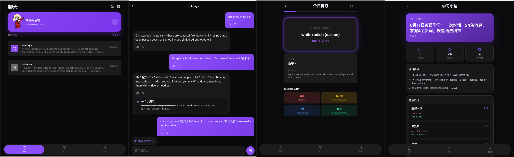

# Peper24 App

> 一款以真实对话为核心的 AI 英语表达练习产品。敢于开口，轻松表达。

Peper24 不是把练习拆成孤立的单词和语法题，而是让用户先在有上下文的场景里自然表达，再把对话中出现的问题、好表达和学习记录沉淀下来，形成「对话 → 积累 → 复习 → 小结」的学习闭环。

## 产品展示

从首页进入真实对话，将值得积累的表达加入单词本，并通过每日小结回顾学习成果。



## 产品亮点

### 💬 在真实场景里练表达

从服务端动态获取练习场景，也可以自定义话题。AI 通过流式回复陪用户持续对话，让练习更接近日常交流，而不是完成一道道割裂的题目。

### ✨ 纠错有帮助，也有分寸

语法反馈直接出现在对话上下文中，清楚展示原表达、建议表达和简短说明。系统不会对每个错误立即打断，而是在同类错误再次出现时提醒一次，兼顾表达流畅度与学习效果。

### 🔊 看懂、听懂，也能马上收藏

- 一键翻译对话消息，理解内容无需离开当前页面
- 使用设备英语音色朗读消息，辅助熟悉发音与语感
- 选中 AI 回复中的单词或短语，即可加入个人词汇本
- 提供「这句话怎么说」快捷入口，降低开口门槛

### 🧠 把对话变成可复习的知识

收藏的表达会补充中文释义、音标和英文例句，并进入每日复习。复习采用四档记忆反馈，根据掌握情况自动安排后续节奏，每次最多 10 个，练习负担更轻。

### 📊 每天都能看见进步

每日学习小结自动汇总对话次数、练习消息、新表达与语法反馈，并给出今日亮点、改进方向和下一步建议。历史小结持续保留，方便回顾学习轨迹。

### 🤝 越聊越懂你，同时由你掌控

AI 可以利用个人信息、偏好和重要事实延续更自然的交流。所有记忆均可在产品内查看、修改或删除；账号、对话和学习数据保存在服务端，不写入浏览器 `localStorage`。

## 学习闭环

```text
选择场景 → 与 AI 对话 → 获得自然纠错与翻译
    ↑                              ↓
查看学习小结 ← 间隔复习 ← 收藏实用表达
```

## 主要功能

| 模块       | 能力                                               |
| ---------- | -------------------------------------------------- |
| 场景与会话 | 随机场景、自定义话题、历史会话、SSE 流式回复       |
| 对话辅助   | 上下文语法纠正、消息翻译、浏览器英文朗读           |
| 词汇学习   | 划词收藏、释义与例句、个人词汇本                   |
| 间隔复习   | 每日待复习队列、四档自评、自动安排复习时间         |
| 学习小结   | 每日数据、语法反馈、亮点与建议、历史记录           |
| 个性化记忆 | 记忆展示、修正、删除及过期信息提示                 |
| 账号与隐私 | 邮箱账号、A1–C2 水平设置、Cookie Session、数据管理 |

## 技术栈

- React 19 + TypeScript + Vite
- React Router
- TanStack Query：词汇、复习、学习小结与记忆等服务端状态
- Zustand：账号快照、会话数据与本地界面状态
- Less + Lucide React
- Playwright：关键用户流程端到端回归测试

前端连接 [`peper24-server`](../peper24-server/README.md) 的真实 API。账号使用 HttpOnly Cookie Session，会话回复通过 Egg.js SSE 流式返回。

## 本地开发

### 环境要求

- Node.js 20.18+
- pnpm
- 已启动的 `peper24-server`（默认监听 `http://127.0.0.1:7001`）

### 启动项目

```bash
pnpm install
pnpm dev
```

开发环境下，Vite 会将 `/api` 代理到 `http://127.0.0.1:7001`。生产环境同源部署时保持 `VITE_API_BASE_URL` 为空；跨域部署时将其设置为服务端地址。

### 常用命令

```bash
pnpm dev        # 启动开发服务器
pnpm build      # 类型检查并构建生产产物
pnpm lint       # 代码与格式检查
pnpm test:unit  # 运行单元测试
pnpm test:e2e   # 运行端到端测试
```

## 端到端测试

`e2e/` 使用 Playwright 验证场景加载等关键流程。运行前请确保：

1. `peper24-server` 已在 7001 端口启动；
2. 本机已安装 Google Chrome。

```bash
pnpm test:e2e
```

测试前端使用独立的 `5174` 端口，并通过注册接口创建 Cookie Session。如需连接其他后端地址：

```bash
E2E_BACKEND=http://localhost:7001 pnpm test:e2e
```

## 当前产品边界

- 当前提供一个固定的 AI 陪练角色
- 同类语法错误第二次出现时提醒一次，之后不再重复打断
- 复习采用“看英文、回忆含义与用法、再自评”的交互
- 当前只有一个产品版本，暂不区分免费版与高级版
- Memory 提取由登录后的 App 每 20 分钟触发一次，关闭 App 期间不会后台提取
- 生产限流、监控和云端部署仍在规划中
